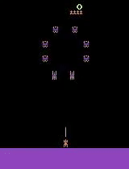
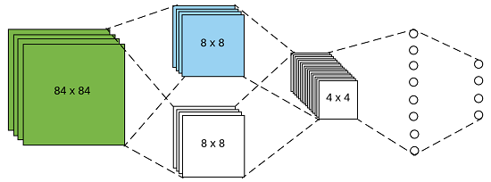

# Atari-DeepReinforcementLearning

This repository contains the source code of my Final Degree Project in Computer Engineering, University of Zaragoza. For further information about this project, read the [project report](report.pdf) (spanish).

## Introduction

This code is based on the code of DQN 3.0, a Lua-based deep reinforcement
learning architecture, necessary to reproduce the experiments
described in the paper "Human-level control through deep reinforcement
learning", Nature 518, 529–533 (26 February 2015) doi:10.1038/nature14236. 
  - https://sites.google.com/a/deepmind.com/dqn/

This code has been modified to create a new DQN architecture with some of his 
layers pretrained, given another neural network. Optionally, these preatrained
layers can be frozen to avoid his modification during the main training. This code 
also allow the pretraining of a part of a layer, creating his complementary 
layer with random weights. The aim of this pretraining is to increase the 
training performance and the result obtained.

Other little modifications have been implemented, like the game screen 
visualization, or the game frames storing.

Pretrained weights have been learned with: 
  - K-means clustering: https://github.com/asabater94/Kmeans-for-Convolutional-Feature-Extration
  - Autoencoders: https://github.com/asabater94/Convolutional-Autoencoder-for-Feature-Extraction
  - Knowledge transfer: using a trained network with one game, to learn other game

 

For further details, read the [project report](report.pdf) (spanish).

## DQN 3.0

A number of dependencies need to be installed, namely:
  * LuaJIT and Torch 7.0
  * nngraph
  * Xitari (fork of the Arcade Learning Environment (Bellemare et al., 2013))
  * AleWrap (a lua interface to Xitari)
An install script for these dependencies is provided.

When all dependencies have been installed, you have to replace the code from 
'torch/share/lua/5.1/alewrap' with the code given in this project to enable 
the screen visualization option.

Two run scripts are provided:
  - run_gpu: trains the DQN network using GPUs according to the given parameters
  - test_tr: executes a performance test and show the game in the screen

## Installation instructions

The installation requires Linux with apt-get.

Note: In order to run the GPU version of DQN, you should additionally have the
NVIDIA® CUDA® (version 5.5 or later) toolkit installed prior to the Torch
installation below.
This can be downloaded from https://developer.nvidia.com/cuda-toolkit
and installation instructions can be found in
http://docs.nvidia.com/cuda/cuda-getting-started-guide-for-linux

To train DQN on Atari games, the following components must be installed: 
  * LuaJIT and Torch 7.0
  * nngraph
  * Xitari
  * AleWrap

To install all of the above in a subdirectory called 'torch', it should be enough to run

    ./install_dependencies.sh

from the base directory of the package.

Note: The above install script will install the following packages via apt-get:
build-essential, gcc, g++, cmake, curl, libreadline-dev, git-core, libjpeg-dev,
libpng-dev, ncurses-dev, imagemagick, unzip

## Training DQN on Atari games

Prior to running DQN on a game, you should copy its ROM in the 'roms' subdirectory.
It should then be sufficient to run the script

    ./run_gpu <game name>

Note: On a system with more than one GPU, DQN training can be launched on a
specified GPU by setting the environment variable GPU_ID, e.g. by

    GPU_ID=2 ./run_gpu <game name>

If GPU_ID is not specified, the first available GPU (ID 0) will be used by default.

## Options

Options to DQN are set within run_gpu and test_tr. 
  - Use '-lnk' to load a pretrained network
    - freeze_kernels: to freeze the pretrained weights
    - traines_kernels_net: path to the pretrained network
    - num_layers: number of the pretrained convolutional layers to load
    - load_num_fc: number of the pretrained fully connected layers to load
  - Use '-sf' to store the training frames
  - display: to enable game screen
